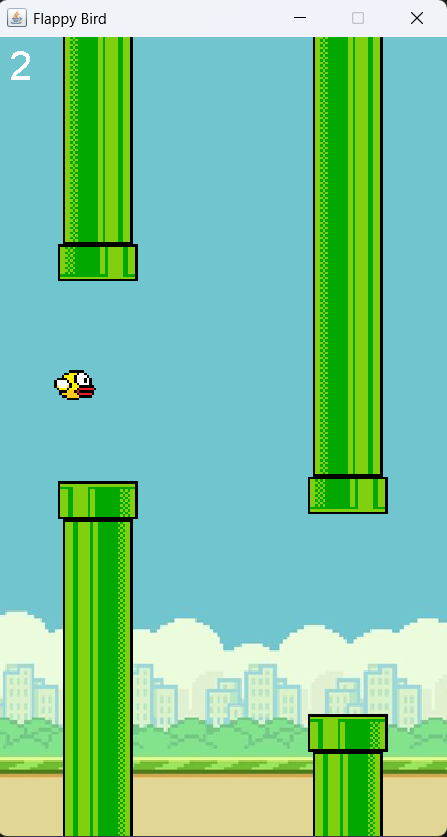

# 🐥 Flappy Bird Game


---

## 🚀 About
🐤 A simple Flappy Bird clone built using Java (Swing/AWT).  
Challenge yourself to navigate the bird through the pipes.  
Perfect for learning game loops, collision detection, and GUI basics.

---

## 📸 Project Preview



---

## ✨ Features
- 🐦 Smooth bird movement & gravity
- 🚀 Moving pipes with random gaps
- 💥 Collision detection & game over
- 🔥 Simple scoring system
- 🖥️ Java Swing / AWT GUI

---

## 🚀 How to Run
1. Clone the repository:
    ```bash
    git clone https://github.com/AbhayDutta/Flappy-Bird-Game.git
    ```
2. Navigate to the project folder:
    ```bash
    cd Flappy-Bird-Game
    ```
3. Compile & run:
    ```bash
    javac src/FlappyBird.java
    java -cp src FlappyBird
    ```

---

## 📝 License
MIT — free to use & modify.  
💖 If you enjoy it, drop a ⭐ on the repo!

---

## 🔥❤️ Happy playing!
